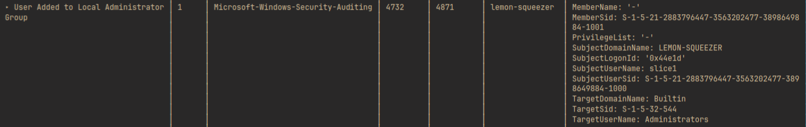

# forensics/infiltration


We are given a file, `security-logs.evtx` which is a Windows security log as described in the challenge description. We are also given a netcat endpoint where we can submit our findings.

```bash
> nc be.ax 32222
Hello agent. Thanks for your hard work in the field researching. We'll now ask you 6 questions on the information you've gathered.
I'd like to take this opportunity to remind you that our targets are located in the United Kingdom, so their timezone is BST (UTC +1).
We'd like to confirm what the username of the main user on the target's computer is. Can you provide this information?
```

The prompt asks for 6 questions regarding information inside the log.

## Analysis

For this challenge we can use tools like python-evtx to analyse the logs using Python script, but I'm going to use WithSecureLabs Chainsaw, "a powerful ‘first-response’ capability to quickly identify threats within Windows forensic artefacts".

We can output the log into readable JSON format.

```bash
> chainsaw dump security-logs.evtx -j > logs_dump.json
```

Of course this just formats the logs. We still need to sift through the content of the logs. We can use chainsaw threat hunting utility with Sigma detection rules.

```bash
> chainsaw hunt security-logs.evtx -s sigma/ --mapping mappings/sigma-event-logs-all.yml > results.txt
```

This will output the potential threat in the logs.

To get the flag we have to answer all the questions from the prompt.

### Question 1

```
We'd like to confirm what the username of the main user on the target's computer is. Can you provide this information?
```

This can be found from the result of chainsaw


The username of the main user is `slice1`

### Question 2

```
Now, we'd like the name of the computer, after it was renamed. Ensure that it is entered in exactly how it is in the logs.
```


At one point the computer name changes to `lemon-squeezy` and when we input this into the prompt we find that asnwer is correct.

### Question 3

```
I wonder if they'll make any lemonade with that lemon-squeezer...
Great work! In order to prevent their lemons from moulding, the lemonthinkers changed the maximum password age. What is this value? Please enter it as an integer number in days.
```

Chainsaw does not counts changing password policy as a security threat thus the result of the command have no information on it. For this we can find in the logs_dump file that we made earlier.

```bash
> cat logs_dump.json | grep 'MaxPasswordAge'
      "MaxPasswordAge": "42:00:00:00",
      "MaxPasswordAge": "42:00:00:00",
      "MaxPasswordAge": "-",
      "MaxPasswordAge": "-",
      "MaxPasswordAge": "83:00:00:00",
```

or we can use text editor like VSCode so we can better context.

```json
"EventData": {
      "DomainBehaviorVersion": "-",
      "DomainName": "LEMON-SQUEEZER",
      "DomainPolicyChanged": "Password Policy",
      "DomainSid": "S-1-5-21-2883796447-3563202477-3898649884",
      "ForceLogoff": "-",
      "LockoutDuration": "-",
      "LockoutObservationWindow": "-",
      "LockoutThreshold": "-",
      "MachineAccountQuota": "-",
      "MaxPasswordAge": "83:00:00:00",
      "MinPasswordAge": "unavailable",
      "MinPasswordLength": "0",
      "MixedDomainMode": "-",
      "OemInformation": "-",
      "PasswordHistoryLength": "0",
      "PasswordProperties": "8",
      "PrivilegeList": "-",
      "SubjectDomainName": "LEMON-SQUEEZER",
      "SubjectLogonId": "0x44e1d",
      "SubjectUserName": "slice1",
      "SubjectUserSid": "S-1-5-21-2883796447-3563202477-3898649884-1000"
    },
```

The prompt ask for the answer of days in integer so we can input `82` and get the correct message again.

### Question 4

```
It seems that our targets are incredibly smart, and turned off the antivirus. At what time did this happen? Give your answer as a UNIX timestamp.
```

We can again refer to the result from Chainsaw where we can see that event ID `4699` which is Scheduled Task Deleted from task `\Microsoft\Windows\Windows Defender\Windows Defender Verification`. We can grab the time stamp and convert it to Unix timestamp, `1721946080`.

### Question 5 and 6

```
The main lemonthinker, slice1, hasn't learnt from the-conspiracy and has (again) downloaded some malware on the system. What is the name of the user created by this malware?

Finally, we'd like to know the name of the privilege level of the user created by the malware. What is this?
```

From the chainsaw result we find that another user was created and was given administrator privilage.


The user was added as seen in the screenshot below, and the subject user SID matches the new user's SID/1



We can input `notabackdoor` for question 5 and `administrator` for question 6.

## Flag

Once all questions are answered we then get the flag

```
corctf{alw4y5_l3m0n_7h1nk_b3f0r3_y0u_c0mm1t_cr1m3}
```
