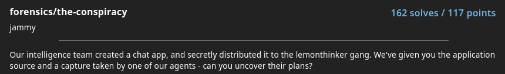

# forensic/the-conspiracy



In this challenge we are given a pcap file and the source code for the chat app given to the lemonthinker gang.

```python
import random
from scapy.all import *
import csv

sources, destinations, messages = [], [], []

with open('chatlogs.csv', mode='r') as file:
    csv_reader = csv.reader(file)
    for row in csv_reader:
        sources.append(row[0])
        destinations.append(row[1])
        messages.append(row[2])

def encrypt(message):
    messagenums = []
    for character in message:
        messagenums.append(ord(character))
    keys = []
    for i in range(len(messagenums)):
        keys.append(random.randint(10, 100))

    finalmessage = []
    for i in range(len(messagenums)):
        finalmessage.append(messagenums[i] * keys[i])

    return keys, finalmessage

for i in range(len(messages)):
    finalmessage, keys = encrypt(messages[i])
    print(finalmessage, keys)
    packet1 = IP(src=sources[i], dst=destinations[i])/TCP(dport=80)/Raw(load=str(finalmessage))
    send(packet1)
    packet2 = IP(src=sources[i], dst=destinations[i])/TCP(dport=80)/Raw(load=str(keys))
    send(packet2)
```

the most interesting part of this source code is the encrypt function. It take encrypts each character by multiplying the ascii value with a randomly generated key.

As for the transmission of the message itself, it sends the encrypted message as the first packet along with the secret keys in the second packet which makes it easy for us to decrypt especially since we have the intercepted packets.

## Solution

```python
from scapy.all import rdpcap, TCP, Raw, IP
import ast

# Load the pcap file
packets = rdpcap('challenge.pcap')

# Store decrypted messages
decrypted_messages = []

# Filter to only TCP packets
tcp_packets = [packet for packet in packets if packet.haslayer(TCP)]

# Iterate over the TCP packets
for i in range(len(tcp_packets) - 1):
    packet1 = tcp_packets[i]
    packet2 = tcp_packets[i + 1]

    if packet1.haslayer(Raw) and packet2.haslayer(Raw):
        ip1 = packet1[IP]
        ip2 = packet2[IP]

        # Check if both packets have the same source and destination IP
        if ip1.src == ip2.src and ip1.dst == ip2.dst:
            # Extract the data from both packets
            data1 = packet1[Raw].load.decode()
            data2 = packet2[Raw].load.decode()

            try:
                # Parse the data as lists of integers
                encrypted_message = ast.literal_eval(data1)
                keys = ast.literal_eval(data2)

                if isinstance(encrypted_message, list) and isinstance(keys, list) and len(encrypted_message) == len(keys):
                    # Decrypt the message
                    decrypted_message = ''
                    for enc, key in zip(encrypted_message, keys):
                        decrypted_message += chr(enc // key)

                    decrypted_messages.append(decrypted_message)
                    print(f"Decrypted message from {ip1.src} to {ip1.dst}: {decrypted_message}")
            except (ValueError, SyntaxError):
                # Handle any errors during parsing
                continue
```

The first step is to filter only TCP packets for optimisatisation. Since the encrypted message and key are sent sequently we can do a check to find the pair by simply checking the source ip and destination ip of packet 1 and packet 2 are the same. We then can use the sent key (packet 2) to decrypt the message (packet 1).

```
> python3 solution.py
Decrypted message from 192.168.87.251 to 192.168.134.8: hello blinkoid
Decrypted message from 192.168.134.8 to 192.168.87.251: hello night
Decrypted message from 192.168.87.251 to 192.168.134.8: how do we eliminate the msfroggers
Decrypted message from 192.168.134.8 to 192.168.87.251: idk i'll ask slice1
Decrypted message from 192.168.134.8 to 192.168.56.19: how do we eliminate the msfroggers
Decrypted message from 192.168.56.19 to 192.168.134.8: we can send them to the skibidi toilet
Decrypted message from 192.168.56.19 to 192.168.134.8: or we can deprive them of their fanum tax
Decrypted message from 192.168.134.8 to 192.168.87.251: slice1 is being useless
Decrypted message from 192.168.87.251 to 192.168.134.8: what's new
Decrypted message from 192.168.56.19 to 192.168.134.8: blinkoid? message back :(
Decrypted message from 192.168.134.8 to 192.168.56.19: oh errr... this sounds great! any more ideas
Decrypted message from 192.168.56.19 to 192.168.134.8: we could co-conspire with the afs
Decrypted message from 192.168.56.19 to 192.168.134.8: and get them to infiltrate the msfroggers
Decrypted message from 192.168.56.19 to 192.168.134.8: that way team lemonthink reins supreme
Decrypted message from 192.168.134.8 to 192.168.56.19: your a genius!
Decrypted message from 192.168.134.8 to 192.168.87.251: alright night
Decrypted message from 192.168.134.8 to 192.168.87.251: i have my own idea
Decrypted message from 192.168.87.251 to 192.168.134.8: let's hear it
Decrypted message from 192.168.134.8 to 192.168.87.251: so yk about the afs
Decrypted message from 192.168.134.8 to 192.168.87.251: if we send our secret code over to them
Decrypted message from 192.168.134.8 to 192.168.87.251: they can use it to infiltrate the afs
Decrypted message from 192.168.87.251 to 192.168.134.8: what's our code again?
Decrypted message from 192.168.134.8 to 192.168.87.251: i think it's corctf{b@53d_af_f0r_th3_w1n}
Decrypted message from 192.168.56.19 to 192.168.87.251: hey night did you hear my idea
Decrypted message from 192.168.87.251 to 192.168.56.19: you had an idea? blinkoid just told me you were being useless
Decrypted message from 192.168.56.19 to 192.168.87.251: what the sigma
```

and so we found the flag.

```
corctf{b@53d_af_f0r_th3_w1n}
```
